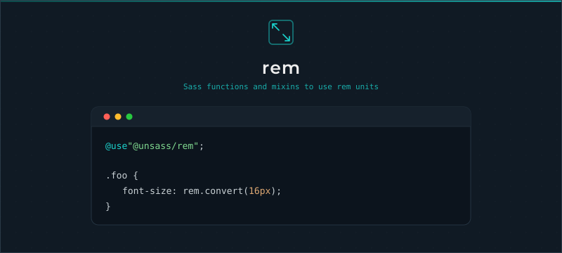

# Rem

[](https://www.npmjs.com/package/@unsass/rem)
[](https://www.npmjs.com/package/@unsass/rem)
[](https://www.npmjs.com/package/@unsass/rem)

## Introduction

A small Sass toolkit for working with `rem` units. Convert `px` values to `rem` against a configurable baseline, and
emit ready-to-use declarations with concise, composable functions and mixins so root-relative sizing stays readable and
consistent.

<div align="center">



</div>

## Installing

```shell
npm install @unsass/rem
```

## Usage

```scss
@use "@unsass/rem";

.foo {
    font-size: rem.convert(16px);
}
```

```css
.foo {
    font-size: 1rem;
}
```

### Options

| Option      | Description                                                            |
|-------------|-----------------------------------------------------------------------|
| `$baseline` | Baseline reference used for the conversion, in `px`. Default: `16px`. |

```scss
@use "@unsass/rem" with (
    $baseline: 10px
);
```

### Top-level config override

A module can only be configured once with `@use ... with`. If the baseline is already configured at the top level (by
another dependency, for example), use the `config()` mixin instead to override it at runtime.

See the [official documentation](https://sass-lang.com/documentation/at-rules/use#with-mixins) about overriding
configuration with mixins.

```scss
@use "@unsass/rem";

@include rem.config(10px);
```

## Mixins

### `declaration($property, $value, $important)`

Emits a declaration for `$property`, converting the `px` values of `$value` to `rem` against the configured `$baseline`.
Pass `$important: true` to append `!important`.

```scss
@use "@unsass/rem";

.foo {
    @include rem.declaration(font-size, 16px); // Single value.
    @include rem.declaration(margin, 20px 30px); // Multiple values.
    @include rem.declaration(border, 1px solid darkcyan); // Multiple mixed values.
    @include rem.declaration(box-shadow, (0 0 10px 5px rgba(darkcyan, 0.75), inset 0 0 10px 5px rgba(darkcyan, 0.75))); // Comma-separated values.
}
```

```css
.foo {
    font-size: 1rem;
    margin: 1.25rem 1.875rem;
    border: 0.0625rem solid darkcyan;
    box-shadow: 0 0 0.625rem 0.3125rem rgba(0, 139, 139, 0.75), inset 0 0 0.625rem 0.3125rem rgba(0, 139, 139, 0.75);
}
```

### `baseline($important)`

Emits a `font-size` declaration that sets the document baseline so that `1rem` matches the configured `$baseline`. With
the default `16px` baseline it resolves to `100%`. Pass `$important: true` to append `!important`.

```scss
@use "@unsass/rem";

html,
body {
    @include rem.baseline;
}
```

```css
html,
body {
    font-size: 100%;
}
```

### `config($baseline)`

Overrides the top-level `@use ... with` configuration at runtime.

```scss
@use "@unsass/rem";

@include rem.config(10px);
```

## Functions

### `convert($values…)`

Converts one or more `px` values to `rem` against the configured `$baseline`. Non-numeric values pass through unchanged,
so mixed and comma-separated values are supported.

```scss
@use "@unsass/rem";

.foo {
    font-size: rem.convert(16px); // Single value.
    margin: rem.convert(20px 30px); // Multiple values.
    border: rem.convert(1px solid darkcyan); // Multiple mixed values.
    box-shadow: rem.convert(0 0 10px 5px rgba(darkcyan, 0.75), inset 0 0 10px 5px rgba(darkcyan, 0.75)); // Comma-separated values.
}
```

```css
.foo {
    font-size: 1rem;
    margin: 1.25rem 1.875rem;
    border: 0.0625rem solid darkcyan;
    box-shadow: 0 0 0.625rem 0.3125rem rgba(0, 139, 139, 0.75), inset 0 0 0.625rem 0.3125rem rgba(0, 139, 139, 0.75);
}
```
